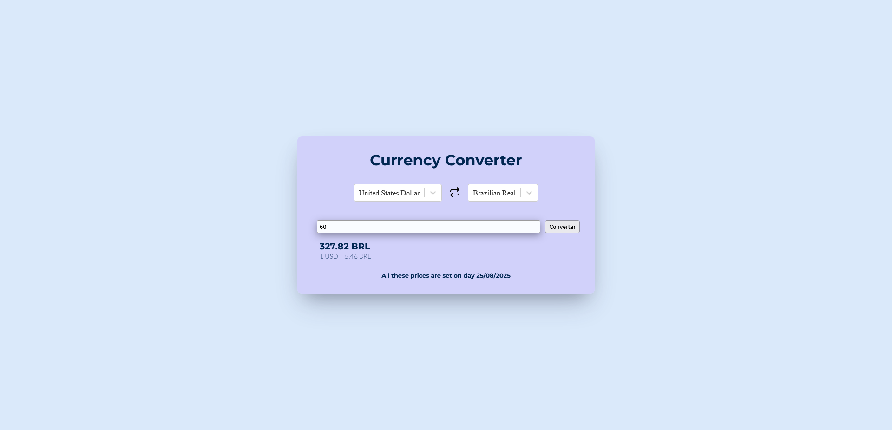

# 💱 currency Converter

Web application built with React that consumes the [exchangerate-api](https://www.exchangerate-api.com/), API that provides access to currency data, including available currencies and real-time exchange rates

  
*Homepage displaying the currency Converter.*

---

## 🧩 Technologies Used

- **HTML5** – Semantic structure of the application  
- **CSS3** – Styling and responsiveness  
- **Lucide React** - Library for displaying icons and symbols
- **ExchangeRate API v4** - Provides currency data and real-time exchange rates
- **TypeScript** - Adds static typing for safer and more maintainable code
- **React** – Library for building the user interface  
  - **Array methods** – Data manipulation (e.g.,`map`)  
  - **react-select** – Customizable select input component

---

## 🚀 Features

 1. Consumes the public API `https://www.exchangerate-api.com/`  
 2. Selection of base currency and target currency.
 3. Real-time conversion of values using fetch in the API.
 4. Button to reverse currencies 🔄.
 5. Dynamic list of currencies and countries obtained directly from the API.
 6. Responsive interface with React Select.

---

## 📥 Installation and Running

1. Clone this repository:
   ```bash
   git clone https://github.com/your-username/e-commerce.git

